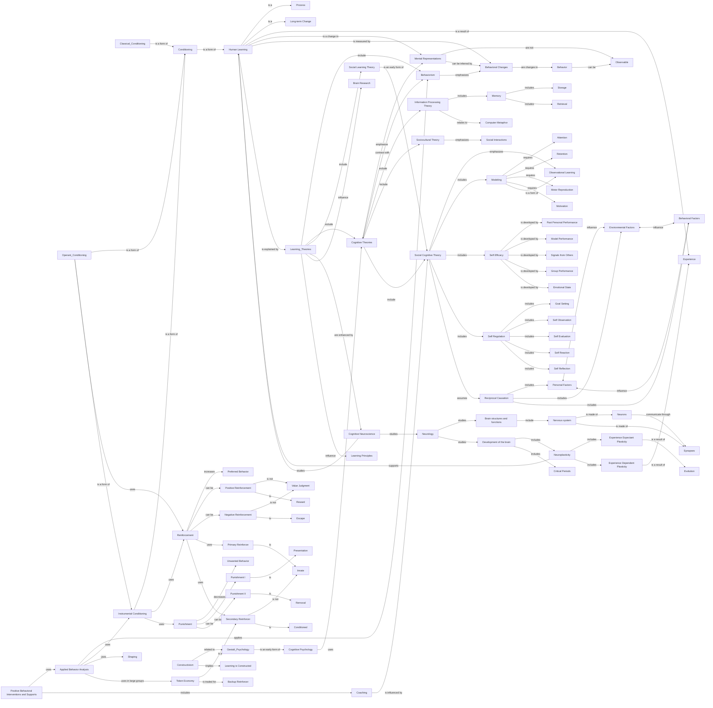

# Human Learning Concept Map

```mermaid
flowchart LR
    Human_Learning["Human Learning"] -- is a --> Process["Process"] & Long_term_Change["Long-term Change"]
    Human_Learning -- is a result of --> Experience["Experience"]
    Human_Learning -- is a change in --> Mental_Representations["Mental Representations"]
    Human_Learning -- is measured by --> Behavioral_Changes["Behavioral Changes"]
    Learning_Theories["Learning_Theories"] -- include --> Behaviorism["Behaviorism"] & Cognitive_Theories["Cognitive Theories"] & Social_Learning_Theory["Social Learning Theory"]
    Learning_Theories -- are enhanced by --> Cognitive_Neuroscience["Cognitive Neuroscience"]
    Human_Learning -- is explained by --> Learning_Theories
    Learning_Theories -- influence --> Brain_Research["Brain Research"] & Learning_Principles["Learning Principles"]
    Cognitive_Neuroscience -- studies --> Neurology["Neurology"] & Human_Learning
    Neurology -- studies --> Brain_structures_and_functions["Brain structures and functions"] & Development_of_the_brain["Development of the brain"]
    Brain_structures_and_functions -- include --> Nervous_system["Nervous system"]
    Development_of_the_brain -- includes --> Neuroplasticity["Neuroplasticity"] & Critical_Periods["Critical Periods"]
    Neuroplasticity -- includes --> Experience_Expectant_Plasticity["Experience Expectant Plasticity"] & Experience_Dependent_Plasticity["Experience Dependent Plasticity"]
    Nervous_system -- is made of --> Neurons["Neurons"] & Synapses["Synapses"]
    Neurons -- communicate through --> Synapses
    Experience_Expectant_Plasticity -- is a result of --> Evolution["Evolution"]
    Experience_Dependent_Plasticity -- is a result of --> Experience
    Neuroplasticity -- supports --> Human_Learning
    Behavioral_Changes -- are changes in --> Behavior["Behavior"]
    Behavior -- can be --> Observable["Observable"]
    Mental_Representations -- are not --> Observable
    Mental_Representations -- can be inferred by --> Behavioral_Changes
    Behaviorism -- emphasizes --> Behavioral_Changes
    Cognitive_Theories -- emphasize --> Mental_Representations
    Conditioning["Conditioning"] -- is a form of --> Human_Learning
    Classical_Conditioning["Classical_Conditioning"] -- is a form of --> Conditioning
    Operant_Conditioning["Operant_Conditioning"] -- is a form of --> Conditioning & Instrumental_Conditioning["Instrumental Conditioning"]
    Operant_Conditioning -- uses --> Reinforcement["Reinforcement"]
    Instrumental_Conditioning -- is a form of --> Conditioning
    Instrumental_Conditioning -- uses --> Reinforcement & Punishment["Punishment"]
    Reinforcement -- increases --> Preferred_Behavior["Preferred Behavior"]
    Reinforcement -- can be --> Positive_Reinforcement["Positive Reinforcement"] & Negative_Reinforcement["Negative Reinforcement"]
    Positive_Reinforcement -- is not --> Value_Judgment["Value Judgment"]
    Negative_Reinforcement -- is not --> Value_Judgment
    Positive_Reinforcement -- is --> Reward["Reward"]
    Negative_Reinforcement -- is --> Escape["Escape"]
    Reinforcement -- uses --> Primary_Reinforcer["Primary Reinforcer"] & Secondary_Reinforcer["Secondary Reinforcer"]
    Primary_Reinforcer -- is --> Innate["Innate"]
    Secondary_Reinforcer -- is not --> Innate
    Secondary_Reinforcer -- is --> Conditioned["Conditioned"]
    Punishment -- decreases --> Unwanted_Behavior["Unwanted Behavior"]
    Punishment -- can be --> Punishment_I["Punishment I"] & Punishment_II["Punishment II"]
    Punishment_I -- is --> Presentation["Presentation"]
    Punishment_II -- is --> Removal["Removal"]
    Applied_Behavior_Analysis["Applied Behavior Analysis"] -- applies --> Behaviorism
    Applied_Behavior_Analysis -- uses --> Instrumental_Conditioning & Shaping["Shaping"]
    Applied_Behavior_Analysis -- uses in large groups --> Token_Economy["Token Economy"]
    Token_Economy -- is a --> Secondary_Reinforcer
    Token_Economy -- is traded for --> Backup_Reinforcer["Backup Reinforcer"]
    Positive_Behavioral_Interventions_and_Supports["Positive Behavioral Interventions and Supports"] -- uses --> Applied_Behavior_Analysis
    Positive_Behavioral_Interventions_and_Supports -- includes --> Coaching["Coaching"]
    Coaching -- is influenced by --> Social_Cognitive_Theory["Social Cognitive Theory"]
    Gestalt_Psychology["Gestalt_Psychology"] -- is an early form of --> Cognitive_Psychology["Cognitive Psychology"]
    Cognitive_Psychology -- uses --> Cognitive_Theories
    Cognitive_Theories <-- contrast with --> Behaviorism
    Cognitive_Theories -- include --> Information_Processing_Theory["Information Processing Theory"] & Sociocultural_Theory["Sociocultural Theory"] & Social_Cognitive_Theory
    Social_Learning_Theory -- is an early form of --> Social_Cognitive_Theory
    Social_Cognitive_Theory -- emphasizes --> Observational_Learning["Observational Learning"]
    Social_Cognitive_Theory -- includes --> Modeling["Modeling"] & Self_Efficacy["Self Efficacy"] & Self_Regulation["Self Regulation"]
    Modeling -- requires --> Attention["Attention"] & Retention["Retention"] & Motor_Reproduction["Motor Reproduction"] & Motivation["Motivation"]
    Modeling -- is a form of --> Observational_Learning
    Self_Efficacy -- is developed by --> Past_Personal_Performance["Past Personal Performance"] & Model_Performance["Model Performance"] & Signals_from_Others["Signals from Others"] & Group_Performance["Group Performance"] & Emotional_State["Emotional State"]
    Self_Regulation -- includes --> Goal_Setting["Goal Setting"] & Self_Observation["Self Observation"] & Self_Evaluation["Self Evaluation"] & Self_Reaction["Self Reaction"] & Self_Reflection["Self Reflection"]
    Social_Cognitive_Theory -- assumes --> Reciprocal_Causation["Reciprocal Causation"]
    Reciprocal_Causation -- includes --> Personal_Factors["Personal Factors"] & Environmental_Factors["Environmental Factors"] & Behavioral_Factors["Behavioral Factors"]
    Personal_Factors <-- influence --> Environmental_Factors
    Personal_Factors <-- influence --> Behavioral_Factors
    Environmental_Factors <-- influence --> Behavioral_Factors
    Sociocultural_Theory -- emphasizes --> Social_Interactions["Social Interactions"]
    Information_Processing_Theory -- includes --> Memory["Memory"]
    Information_Processing_Theory -- relates to --> Computer_Metaphor["Computer Metaphor"]
    Memory -- includes --> Storage["Storage"] & Retrieval["Retrieval"]
    Constructivism["Constructivism"] -- related to --> Gestalt_Psychology
    Constructivism -- implies --> Learning_is_Constructed["Learning is Constructed"]
```
